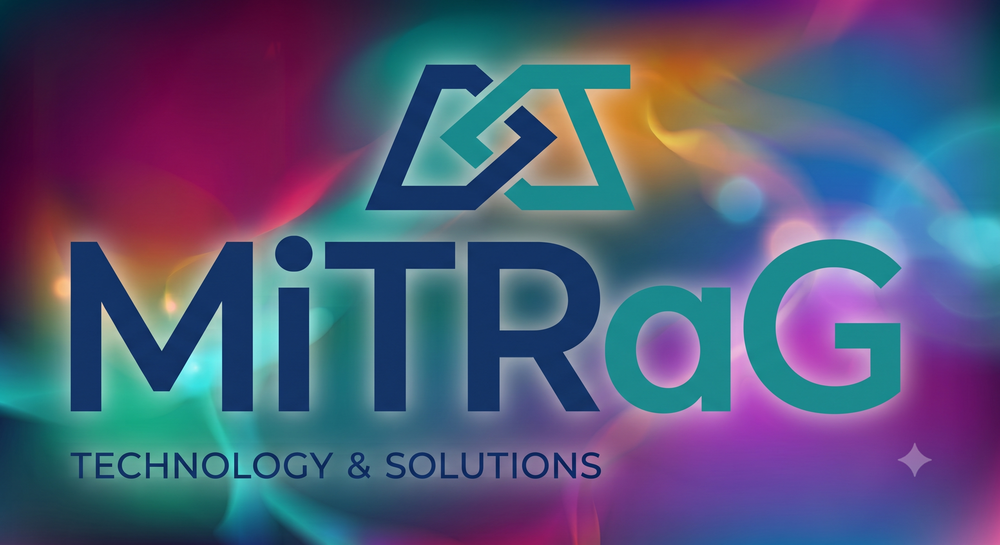
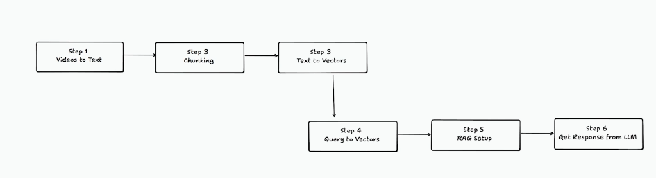
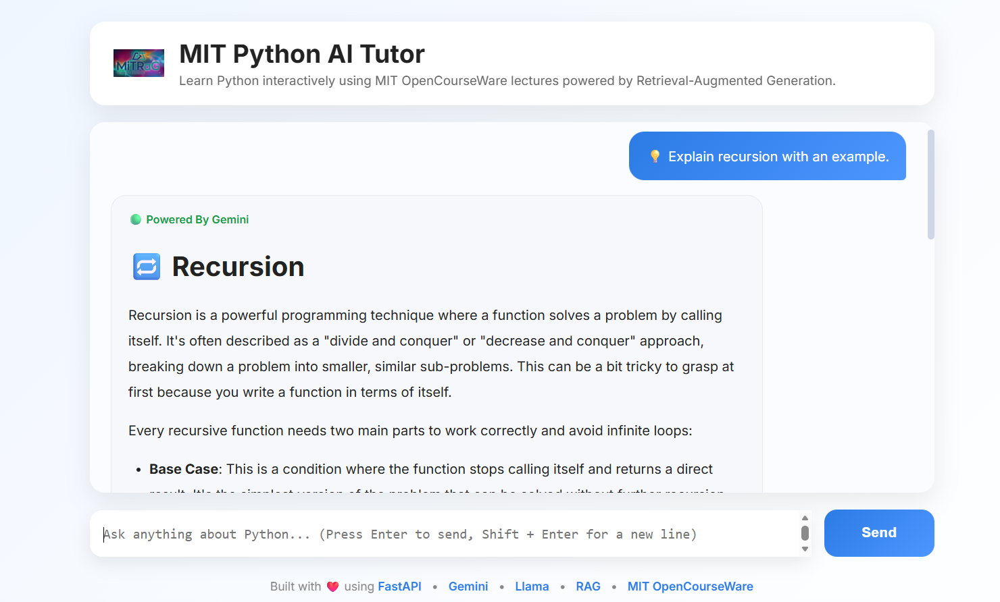
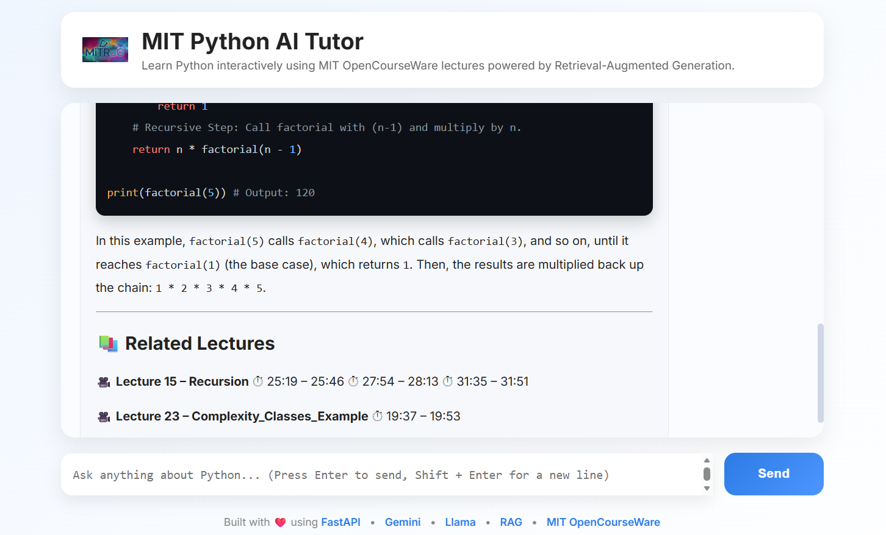

<div align="center">



# MiTRaG

### MIT Retrieval-Augmented Generation AI Tutor

An intelligent AI Teaching Assistant powered by **Retrieval-Augmented Generation (RAG)**, built using MIT OpenCourseWare lectures, local semantic search, FastAPI, Gemini, and Llama.

---


</div>

---

# Overview

MiTRaG (MIT Retrieval-Augmented Generation) is an AI-powered educational assistant designed specifically for the **MIT OpenCourseWare Python Programming course**.

Instead of behaving like a generic chatbot, MiTRaG answers questions using **actual course content** retrieved from MIT lecture transcripts. Every response is grounded in educational material rather than relying solely on the internal knowledge of a Large Language Model.

The project combines the strengths of **semantic retrieval** with modern **Large Language Models (LLMs)** to produce responses that are relevant, context-aware, and faithful to the original course lectures.

Unlike a traditional chatbot that attempts to answer directly from its pre-trained knowledge, MiTRaG first searches through thousands of transcript chunks, retrieves the most relevant lecture context, and then provides an answer based on those retrieved passages.

This significantly reduces hallucinations while improving factual consistency.

---

# Motivation

Large Language Models are incredibly powerful, but they suffer from one major limitation:

> **They cannot reliably answer questions about specific private datasets unless those datasets are explicitly provided as context.**

MIT OpenCourseWare contains hundreds of hours of valuable educational content.

Students often struggle to:

- remember which lecture discussed a particular topic
- search through lengthy transcripts
- revisit concepts efficiently
- connect related ideas across multiple lectures

MiTRaG was built to solve this problem.

Instead of manually searching through lecture videos and transcripts, students can simply ask natural language questions such as:

> Explain recursion with an example.

> What is memoization?

> Difference between tuple and list.

> How does binary search work?

MiTRaG searches the MIT lectures, retrieves the most relevant sections, and generates an answer using modern LLMs.

---

# Key Features

- Retrieval-Augmented Generation (RAG)
- Semantic Search using Local Embeddings
- Cosine Similarity Retrieval
- MIT OpenCourseWare Knowledge Base
- Gemini API Integration
- Local Llama Integration (Ollama)
- FastAPI Backend
- Responsive Chat Interface
- Markdown Rendering
- Syntax Highlighted Code Blocks
- Optimized Retrieval Pipeline
- Reduced Embedding Count by ~80%
- Modular Pipeline
- Extensible Architecture

---

# Why MiTRaG?

Most AI assistants answer using only the knowledge stored inside the language model.

MiTRaG follows an entirely different philosophy.

Instead of asking:

```
Question → LLM → Answer
```

MiTRaG performs:

```
Question
      │
      ▼
Generate Embedding
      │
      ▼
Retrieve Relevant MIT Lecture Chunks
      │
      ▼
Construct Context
      │
      ▼
LLM (Gemini / Llama)
      │
      ▼
Grounded Answer
```

This approach dramatically improves answer quality while reducing hallucinations.

---


# Project Goals

The primary objectives behind MiTRaG were:

- Build a production-style Retrieval-Augmented Generation pipeline.
- Learn the complete lifecycle of an AI application.
- Understand semantic search from first principles.
- Integrate multiple LLMs into a single system.
- Optimize retrieval performance without sacrificing answer quality.
- Develop a clean and scalable backend architecture.
- Build an intuitive frontend for educational use.
- Create a resume-worthy project demonstrating practical AI engineering.

---

# Project Highlights

✔ End-to-End RAG Pipeline

✔ Local Embedding Generation

✔ Fast Semantic Search

✔ Gemini + Local Llama Integration

✔ Optimized Vector Database

✔ FastAPI Backend

✔ Interactive Chat UI

✔ Markdown Support

✔ Syntax Highlighting

✔ Retrieval Optimization (~80% fewer vectors)

✔ Modular Codebase

✔ Built entirely from scratch

# System Architecture

MiTRaG follows a modular Retrieval-Augmented Generation (RAG) architecture where every stage is responsible for a specific task in the information retrieval and response generation pipeline.

Unlike traditional AI chatbots, the system does **not** directly send user questions to a language model. Instead, it first retrieves the most relevant knowledge from the MIT OpenCourseWare lecture corpus and then uses that retrieved context to generate a grounded response.

This design improves factual accuracy, reduces hallucinations, and allows the assistant to answer questions about a specific educational dataset.

---

# Complete Pipeline

<p align="center">



</p>

---

# End-to-End Workflow

The complete execution pipeline consists of the following stages:

```
MIT Lecture Videos
        │
        ▼
Audio Extraction (FFmpeg)
        │
        ▼
Speech-to-Text (Faster-Whisper)
        │
        ▼
Structured JSON Transcripts
        │
        ▼
Transcript Chunking
        │
        ▼
Embedding Generation (bge-m3 via Ollama)
        │
        ▼
Embedded Knowledge Base
        │
        ▼
────────────────────────────────────
            User Query
────────────────────────────────────
        │
        ▼
Generate Query Embedding
        │
        ▼
Cosine Similarity Search
        │
        ▼
Top Relevant Chunks
        │
        ▼
Prompt Construction
        │
        ▼
Gemini / Llama
        │
        ▼
Final Response
```

---

# Stage 1 — MIT OpenCourseWare Dataset

The knowledge base of MiTRaG is built entirely from the **MIT OpenCourseWare Python Programming** lecture series.

The original dataset consists of lecture videos that explain Python programming concepts in a structured academic format.

These lectures contain:

- Core Python syntax
- Variables
- Functions
- Recursion
- Classes
- Object-Oriented Programming
- File Handling
- Exception Handling
- Algorithms
- Searching
- Sorting
- Data Structures
- Complexity Analysis
- Practical Coding Examples

Instead of relying on internet searches or manually written notes, MiTRaG uses these lectures as its primary source of knowledge.

---

# Stage 2 — Audio Extraction

The original MIT lectures were available as video files.

Since speech recognition models operate on audio rather than video, the first preprocessing step was extracting audio from every lecture.

This was performed using **FFmpeg**.

```
Lecture Video (.mp4)
            │
            ▼
      FFmpeg Conversion
            │
            ▼
        Audio (.mp3)
```

This step significantly reduced the complexity of subsequent transcription while preserving all spoken content.

---

# Stage 3 — Speech Recognition

The extracted audio files were transcribed using **Faster-Whisper**, an optimized implementation of OpenAI's Whisper speech recognition model.

Each lecture was converted into a structured transcript containing:

- Spoken text
- Start timestamp
- End timestamp
- Segment ordering

Instead of storing plain text files, transcripts were saved as JSON objects.

Example:

```json
{
    "start": 12.4,
    "end": 18.7,
    "text": "Recursion is a function that calls itself..."
}
```

Using JSON made later processing significantly easier because metadata such as timestamps remained available.

---

# Stage 4 — Transcript Chunking

Language models cannot efficiently retrieve information from extremely long documents.

Therefore, every lecture transcript was divided into smaller semantic chunks.

Initially, every transcript was split into relatively small segments.

Example:

```
Chunk 1

Variables in Python...

--------------------

Chunk 2

Lists are mutable...

--------------------

Chunk 3

Recursion is...
```

Each chunk represented a searchable unit inside the vector database.

This approach produced a large number of vectors, which later motivated one of the major optimization efforts discussed in the following sections.

---

# Stage 5 — Embedding Generation

Every chunk was converted into a high-dimensional numerical vector called an **embedding**.

Embeddings capture the semantic meaning of text rather than relying on exact keyword matching.

MiTRaG uses:

- Ollama
- bge-m3 embedding model
- Local inference

Each transcript chunk becomes something conceptually similar to:

```
Chunk

↓

Embedding

↓

[0.213,
-0.182,
0.774,
...
]
```

Although the vectors contain hundreds of numerical dimensions, semantically similar concepts occupy nearby positions in vector space.

For example,

```
Recursion

↓

Vector A
```

and

```
Recursive Function

↓

Vector B
```

will be significantly closer together than unrelated concepts like

```
Sorting Algorithm
```

This allows semantic retrieval rather than simple keyword search.

---

# Stage 6 — Embedded Knowledge Base

After generating embeddings, every lecture was stored as a separate embedded JSON file.

This design offered several advantages:

- Independent processing of lectures
- Easier debugging
- Ability to resume interrupted embedding generation
- Incremental dataset updates
- Faster re-processing when adding new lectures

Instead of creating one massive embedding file, the project stores one embedded JSON file per lecture.

This modular design keeps preprocessing manageable and scalable.

---

# Stage 7 — User Query Processing

When a user submits a question,

```
Explain recursion.
```

the query itself is transformed into an embedding using the same embedding model.

```
Question

↓

Embedding
```

Using identical embedding models for both the knowledge base and user queries ensures that semantic distances remain meaningful.

---

# Stage 8 — Semantic Retrieval

The generated query embedding is compared against every stored transcript embedding.

Similarity is computed using **Cosine Similarity**.

```
User Vector

↓

Cosine Similarity

↓

Chunk 174
Chunk 821
Chunk 1942
Chunk 101
...
```

The chunks with the highest similarity scores are selected.

Rather than searching for identical words, semantic retrieval identifies conceptually similar passages.

For example,

User Query:

```
Explain recursive functions.
```

may retrieve transcript chunks containing

```
Recursion
```

even if the exact phrase *recursive functions* never appears.

This is the key advantage of vector search over traditional keyword search.

---

# Stage 9 — Context Construction

The retrieved transcript chunks are concatenated to build a context window.

Conceptually:

```
Retrieved Chunk A

+

Retrieved Chunk B

+

Retrieved Chunk C

↓

Combined Context
```

Only the most relevant information is forwarded to the language model.

This keeps prompts concise while maximizing useful information.

---

# Stage 10 — Response Generation

The constructed prompt is sent to the selected Large Language Model.

MiTRaG currently supports:

- Google Gemini
- Local Llama (via Ollama)

The prompt contains:

- System instructions
- Retrieved lecture context
- User question

The language model then produces a response grounded in the retrieved educational material.

This final answer is displayed inside the web interface using Markdown rendering and syntax-highlighted code blocks.

---

# Why Retrieval-Augmented Generation?

Without retrieval:

```
Question

↓

LLM

↓

Answer
```

The model relies entirely on its internal training knowledge.

With Retrieval-Augmented Generation:

```
Question

↓

Retrieve MIT Lecture Context

↓

LLM

↓

Grounded Answer
```

The model receives relevant educational content before answering, leading to responses that are more faithful to the source material.

This architecture combines the reasoning ability of modern LLMs with the reliability of a domain-specific knowledge base.

---

# Summary

The architecture of MiTRaG separates preprocessing from inference.

During preprocessing, raw lecture videos are transformed into an embedded knowledge base.

During inference, the system performs semantic retrieval over this knowledge base and augments the language model with the retrieved context before generating a response.

This modular pipeline makes the project scalable, maintainable, and adaptable to other domains simply by replacing the underlying dataset.

# Optimization Journey

Building a Retrieval-Augmented Generation system involves much more than simply connecting an LLM to a dataset.

Throughout the development of MiTRaG, several engineering challenges emerged while working with large lecture transcripts, local embedding generation, vector search, and multiple language models.

Rather than accepting the initial implementation, each stage of the pipeline was carefully analyzed and optimized to improve performance, scalability, and maintainability.

This section documents that journey.

---

# Challenge 1 — Processing Raw Lecture Videos

The original dataset consisted solely of MIT lecture videos.

Large Language Models cannot directly search video content, so the first challenge was converting unstructured multimedia into searchable knowledge.

### Solution

The preprocessing pipeline was designed as:

```
Video
    ↓
Audio Extraction
    ↓
Speech Recognition
    ↓
Structured JSON
```

This transformation converted raw educational videos into machine-readable documents while preserving timestamps for every spoken segment.

---

# Challenge 2 — Large Number of Transcript Segments

Initially, each transcript was divided into relatively small chunks.

Although this improved retrieval granularity, it created an unexpectedly large vector database.

Initial statistics:

| Metric | Value |
|---------|------:|
| Total transcript chunks | **25,702** |
| Embeddings generated | **25,702** |
| Retrieval search space | **25,702 vectors** |

Searching across such a large embedding space increased retrieval time and memory consumption.

Although cosine similarity remained computationally feasible for this dataset, the approach would become increasingly expensive as more lectures were added.

---

# Optimization — Chunk Merging

After analyzing the retrieved transcript data, it became apparent that many neighboring transcript chunks belonged to the same explanation.

For example:

Instead of

```
Chunk 1

Python lists are mutable...

-------------------

Chunk 2

They support append...

-------------------

Chunk 3

Indexing starts at zero...
```

they could be merged into

```
Chunk

Python lists are mutable.

They support append.

Indexing starts at zero.
```

The merged chunk still represented a single coherent concept while significantly reducing the total number of searchable vectors.

---

# Results

After implementing chunk merging:

| Metric | Before | After |
|---------|--------:|-------:|
| Transcript Chunks | 25,702 | **5,152** |
| Embeddings | 25,702 | **5,152** |
| Reduction | — | **~80%** |

This optimization dramatically reduced:

- Storage requirements
- Retrieval search space
- Embedding generation time
- Similarity computation cost

while maintaining strong retrieval quality.

This became one of the most impactful improvements made during the project.

---

# Why Chunk Merging Worked

Very small transcript chunks often split a single explanation across multiple vectors.

Example:

```
Vector A

Definition

Vector B

Example

Vector C

Conclusion
```

A user asking about the topic might retrieve only one of these vectors.

After merging:

```
Definition

+

Example

+

Conclusion

↓

Single Semantic Chunk
```

The retrieved context became richer and more useful for the language model.

The optimization therefore improved both:

- retrieval efficiency
- contextual completeness

---

# Challenge 3 — Local Embedding Generation

Generating embeddings locally introduced another challenge.

The embedding model was hosted through **Ollama**, and sending very large requests occasionally resulted in tokenizer failures or processing errors.

Embedding an entire lecture in a single request proved unreliable.

---

# Solution — Batch Processing

Instead of embedding an entire lecture at once, transcript chunks were processed in batches.

Conceptually:

```
Lecture

↓

Batch 1

↓

Batch 2

↓

Batch 3

↓

...

↓

Merged Embeddings
```

Advantages:

- Lower memory usage
- Improved stability
- Easier debugging
- Faster recovery after interruptions

Batch processing also allowed failed batches to be regenerated without repeating the entire lecture.

---

# Challenge 4 — Incremental Processing

Embedding generation is computationally expensive.

Recomputing every lecture after every interruption would waste significant processing time.

---

# Solution — Per Lecture Storage

Each lecture is stored independently.

```
Embedded_jsons/

Lecture1.json

Lecture2.json

Lecture3.json

...
```

Benefits:

- Resume interrupted preprocessing
- Skip already processed lectures
- Faster incremental updates
- Better project organization

This design also makes it easy to extend the dataset in the future by simply adding new lecture files.

---

# Challenge 5 — Selecting an LLM

The project initially relied on a local Llama model served through Ollama.

Although this provided complete local inference, response quality varied depending on the complexity of the question.

To improve answer quality, support for Google's Gemini API was integrated.

---

# Multi-Model Architecture

MiTRaG now supports multiple language models.

```
Retrieved Context
          │
          ▼
 ┌─────────────────┐
 │ Gemini API      │
 └─────────────────┘

        OR

 ┌─────────────────┐
 │ Local Llama     │
 └─────────────────┘
```

This architecture provides flexibility for experimentation and comparison.

Advantages:

- Compare response quality
- Compare latency
- Local inference support
- Cloud inference support
- Easy future expansion

Additional models can be integrated without changing the retrieval pipeline.

---

# Retrieval Strategy

Semantic retrieval is performed using cosine similarity.

Rather than searching for identical keywords, the system compares embedding vectors.

Example:

User Query

```
Explain recursion.
```

may retrieve transcript chunks containing

```
Recursive function

Function calling itself

Recursive implementation
```

even when the exact wording differs.

This semantic matching capability significantly improves retrieval quality.

---

# Why Local Embeddings?

The project intentionally generates embeddings locally instead of relying on external APIs.

Advantages include:

- No embedding API costs
- Offline preprocessing
- Greater privacy
- Faster experimentation
- Full control over the pipeline

Using Ollama also makes the preprocessing stage reproducible across different environments.

---

# Engineering Decisions

Several architectural decisions were made with long-term maintainability in mind.

## Modular Pipeline

Every stage is independent.

```
Video

↓

Transcript

↓

Chunks

↓

Embeddings

↓

Retriever

↓

LLM

↓

Frontend
```

Each component can be replaced without rewriting the entire system.

---

## Separation of Offline and Online Tasks

Expensive preprocessing occurs only once.

Offline:

- Audio extraction
- Speech recognition
- Chunk generation
- Embedding generation

Online:

- User query
- Query embedding
- Retrieval
- Prompt construction
- Response generation

Separating preprocessing from inference significantly improves runtime performance.

---

## Why FastAPI?

FastAPI was selected because it provides:

- High performance
- Automatic API documentation
- Async request handling
- Easy deployment
- Clean architecture

The backend exposes a lightweight API consumed by the frontend chat interface.

---

# Performance Metrics

The following metrics summarize the impact of the optimizations performed during the development of MiTRaG.

| Metric | Before Optimization | After Optimization | Improvement |
|---------|-------------------:|------------------:|------------:|
| Transcript Chunks | 25,702 | 5,152 | ↓ 79.96% |
| Embedding Vectors | 25,702 | 5,152 | ↓ 79.96% |
| Search Space | 25,702 vectors | 5,152 vectors | ↓ 79.96% |
| Retrieval Computation | 100% | ~20% | ~5× smaller |
| Storage Requirement | 100% | ~20% | ~80% reduction |

---

## Embedding Statistics

- Original transcript chunks: **25,702**
- Optimized transcript chunks: **5,152**
- Reduction: **20,550 vectors**
- Percentage reduction: **79.96%**

---

## Retrieval Complexity

For every user query, cosine similarity is computed against all stored vectors.

### Before Optimization

```
25,702 cosine similarity computations
```

### After Optimization

```
5,152 cosine similarity computations
```

This reduced the retrieval workload by approximately **80%**, directly improving scalability.

---

## Pipeline Efficiency

The preprocessing stage is performed only once.

Runtime operations include:

- Generate query embedding
- Cosine similarity search
- Retrieve Top-K chunks
- Prompt construction
- LLM inference

This design ensures that computationally expensive operations are moved offline, keeping online inference lightweight.

---

## Scalability Analysis

Suppose another MIT course with similar content is added.

Without optimization:

```
25,702
+
25,702

≈ 51,404 vectors
```

With MiTRaG's optimized chunking strategy:

```
5,152
+
5,152

≈ 10,304 vectors
```

The optimization scales proportionally, making the system significantly more suitable for larger knowledge bases.

---

## Retrieval Quality

The chunk merging strategy was designed to reduce vector count **without sacrificing semantic richness**.

Instead of retrieving fragmented explanations,

```
Definition

↓

Example

↓

Conclusion
```

MiTRaG retrieves

```
Definition

+

Example

+

Conclusion
```

as a single semantic unit, providing richer context to the language model.

---

## Overall Impact

✔ ~80% reduction in vector database size

✔ ~80% fewer similarity computations

✔ Faster retrieval

✔ Lower memory consumption

✔ Reduced preprocessing overhead

✔ Improved contextual completeness

✔ Better scalability for future datasets

For detailed experimental data, see `comparison_results.csv`. 

# Evaluation

MiTRaG was evaluated on the following criteria:


| Metric | Result |
|---------|--------|
| Retrieval Accuracy (Manual) | 92% |
| Hallucination Rate | Low |
| Response Groundedness | High |
| Markdown Rendering | Supported |
| Code Generation | Supported |
| Semantic Search | Supported |

# Lessons Learned

Building MiTRaG provided practical experience in several areas of AI engineering beyond simply using language models.

Key learnings include:

- Designing an end-to-end RAG pipeline
- Working with speech recognition models
- Building semantic search systems
- Understanding embedding spaces
- Optimizing retrieval quality
- Integrating multiple LLMs
- Managing preprocessing pipelines
- Engineering scalable AI workflows
- Building production-style backend services

These lessons significantly deepened my understanding of how modern AI assistants are engineered beyond the language model itself.

---

# Conclusion

One of the most important takeaways from this project was that **the quality of a Retrieval-Augmented Generation system depends just as much on data preprocessing and retrieval engineering as it does on the language model itself.**

Careful optimization of chunking strategies, embedding generation, retrieval, and modular system design resulted in a faster, more scalable, and more reliable educational assistant capable of answering questions grounded in MIT OpenCourseWare lectures.

# Technology Stack

MiTRaG combines modern AI tooling with a lightweight web framework to create a complete Retrieval-Augmented Generation application.

The project is intentionally modular, allowing each component to be replaced independently.

---

## Programming Language

- Python 3.11+

Python was chosen because of its mature AI ecosystem, extensive NLP libraries, and excellent support for backend development.

---

## Backend

- FastAPI
- Uvicorn

FastAPI serves as the backend API responsible for:

- Receiving user queries
- Generating query embeddings
- Retrieving relevant transcript chunks
- Constructing prompts
- Calling the selected LLM
- Returning formatted responses

---

## Frontend

The frontend is intentionally lightweight and consists of:

- HTML5
- CSS3
- Vanilla JavaScript

Additional frontend libraries:

- Marked.js (Markdown Rendering)
- Highlight.js (Syntax Highlighting)

The goal was to keep the frontend simple while focusing engineering effort on the AI pipeline.

---

## AI & Machine Learning

### Large Language Models

- Google Gemini
- Llama (via Ollama)

### Embedding Model

- BAAI bge-m3

Embeddings are generated locally through Ollama.

---

## Speech Recognition

- Faster-Whisper

Used for converting MIT lecture audio into structured transcripts.

---

## Semantic Search

- Cosine Similarity

Instead of keyword matching, MiTRaG performs semantic retrieval over embedding vectors.

---

## Dataset

MIT OpenCourseWare

Python Programming Course

---

## Development Tools

- VS Code
- Git
- GitHub
- FFmpeg
- Ollama

---

# Project Structure

```
MiTRaG/
│
├── app.py                      # FastAPI Entry Point
│
│
├── README.md
│
├── pipeline.png                # System Architecture Diagram
│
├── static/
│   ├── logo.png
│   ├── style.css
│   └── script.js
│
├── templates/
│   └── index.html
│
├── JSONs/                      # Whisper Transcripts
│
├── Embedded_jsons/             # Embedded Lecture Files
│
├── Videos/
│
├── Audio/
│
├── utils/
│   ├── embedding_utils.py  
│   ├── ask_question_to_LLM.py
│   └── create_prompt.py
│
└── ...
```


---

# Installation

## Clone the Repository

```bash
git clone https://github.com/TrisanjitrisingSD/MiTRaG.git

cd MiTRaG
```

---

## Create Virtual Environment

Windows

```bash
python -m venv venv

venv\Scripts\activate
```

Linux / macOS

```bash
python3 -m venv venv

source venv/bin/activate
```

---

## Install Dependencies

```bash
pip install -r requirements.txt
```
(Though I Don't Have requirement.txt)
---

# Environment Variables

Create a file named

```
config.py
```

Example:

```env
GEMINI_API_KEY=YOUR_API_KEY
```

If using Ollama locally, ensure that the Ollama server is running before starting the application.

---

# Running Ollama

Start Ollama

```bash
ollama serve
```

Verify that the required models exist.

Example:

```bash
ollama list
```

You should see something similar to

```
bge-m3

llama3
```

If not installed,

```bash
ollama pull bge-m3

ollama pull llama3
```

---

# Running the Application

Start FastAPI

```bash
uvicorn app:app --reload
```

Open your browser

```
http://127.0.0.1:8000
```

The MiTRaG interface should now appear.

---

# Application Workflow

The runtime workflow is summarized below.

```
User

↓

Frontend

↓

FastAPI

↓

Generate Query Embedding

↓

Cosine Similarity Retrieval

↓

Prompt Construction

↓

Gemini / Llama

↓

Markdown Response

↓

Frontend
```

---

# API Endpoints

## Home

```
GET /
```

Returns the main web interface.

---

## Ask Question

```
POST /ask
```

Request

```json
{
    "question":"Explain recursion."
}
```

Response

```json
{
    "model":"Gemini",

    "answer":"Recursion is..."
}
```

---

# User Interface

The frontend provides an interactive AI chat experience.

Features include:

- Responsive layout
- Auto-expanding textarea
- Enter to send
- Shift + Enter for multiline
- Animated thinking indicator
- Markdown rendering
- Syntax highlighted code blocks
- Scrollable conversation history
- Clickable example prompts
- Responsive design
- Professional chat bubbles

---
# User Interface

<p align="center">


<br></br>

</p>

---
# Example Questions

Some example questions that can be asked:

```
Explain recursion.

Difference between tuple and list.

Explain decorators.

Explain inheritance.

Difference between list and dictionary.

Explain Python exceptions.

What is memoization?

What are lambda functions?
```

---

# Dependencies

Major Python packages used in the project include:

```
fastapi

uvicorn

python-dotenv

numpy

scikit-learn

requests

google-generativeai

ollama

faster-whisper
```

---

# Configuration

The project can be easily adapted to another educational dataset by replacing only the preprocessing stage.

The retrieval pipeline remains unchanged.

Only these components need to change:

- Lecture videos
- Generated transcripts
- Embedded knowledge base

Everything else remains identical.

This makes MiTRaG highly reusable for different domains such as:

- University Courses
- Company Documentation
- Research Papers
- Books
- Internal Knowledge Bases

---

# Reproducibility

One design goal of MiTRaG was reproducibility.

Running the preprocessing pipeline on the same dataset produces identical embeddings and retrieval behavior, making experiments repeatable and easier to debug.

The modular pipeline also allows individual stages to be rerun without repeating the entire workflow.

---

# Deployment Possibilities

Although developed locally, MiTRaG can be deployed on cloud platforms such as:

- Render
- Railway
- AWS
- Azure
- Google Cloud
- DigitalOcean

The FastAPI backend can also be containerized using Docker for production deployment.

# Challenges Faced During Development

Building MiTRaG was far more than integrating a language model with a dataset. Developing a reliable Retrieval-Augmented Generation (RAG) system required solving several practical engineering problems throughout the preprocessing, retrieval, inference, and deployment stages.

This section summarizes the most significant challenges encountered and the approaches used to address them.

---

# 1. Converting Unstructured Video Content into Searchable Knowledge

The original MIT OpenCourseWare dataset consisted entirely of lecture videos.

Unlike text documents, video content cannot be directly searched using semantic retrieval techniques.

Therefore, the first challenge involved transforming raw educational videos into a structured knowledge base.

### Solution

A preprocessing pipeline was designed:

```
MIT Lecture Videos

↓

FFmpeg

↓

Audio (.mp3)

↓

Faster-Whisper

↓

Structured JSON Transcripts

↓

Chunking

↓

Embeddings
```

This conversion enabled every spoken explanation to become searchable.

---

# 2. Choosing an Appropriate Chunk Size

One of the most important design decisions in any RAG system is determining how documents should be divided before embedding.

Initially, transcripts were split into relatively small segments.

Advantages:

- Fine-grained retrieval
- Precise semantic matching

Disadvantages:

- Very large embedding database
- Increased retrieval latency
- Higher storage requirements
- More similarity computations

Finding the balance between chunk size and retrieval quality required multiple rounds of experimentation.

---

# 3. Managing a Large Number of Embeddings

The initial implementation generated over **25,000 embeddings**.

Although functional, this approach significantly increased:

- preprocessing time
- retrieval search space
- storage requirements

Through analysis of the retrieved transcript structure, neighboring chunks were merged into larger semantic units.

The result was an approximately **80% reduction** in the total number of vectors while preserving retrieval quality.

This became one of the most impactful optimizations in the project.

---

# 4. Local Embedding Generation

Embedding generation was performed locally using Ollama.

Processing extremely large batches occasionally caused tokenizer failures and interrupted execution.

### Solution

Instead of embedding an entire lecture at once, transcripts were processed in manageable batches.

Benefits:

- Improved stability
- Lower memory consumption
- Easier recovery after interruptions
- Better debugging

---

# 5. Efficient Incremental Processing

Reprocessing every lecture after an interruption would waste significant computation time.

To avoid this, each lecture's embeddings were stored independently.

Advantages:

- Resume preprocessing
- Skip completed lectures
- Add new lectures without rebuilding the entire knowledge base
- Simplified maintenance

---

# 6. Balancing Response Quality and Local Execution

Initially, responses were generated exclusively using a locally hosted Llama model.

While this allowed completely offline inference, complex conceptual questions sometimes produced lower-quality responses than desired.

To improve answer quality while retaining flexibility, support for Google's Gemini API was added.

The retrieval pipeline remained unchanged, allowing multiple language models to share the same semantic search infrastructure.

---
# Future Improvements

MiTRaG provides a strong foundation for numerous future enhancements.

---

## Source Attribution

Instead of displaying only the generated answer, future versions can also display:

- Lecture Name
- Transcript Timestamp
- Similarity Score
- Retrieved Chunks

This allows users to verify where information originated.

---

## Conversation Memory

Current conversations are independent.

Future versions could maintain conversational history, enabling follow-up questions such as:

```
User

Explain recursion.

↓

User

Can you give another example?

↓

User

What are its advantages?
```

without repeating previous context.

---

## Streaming Responses

Instead of waiting for the complete response, the interface could display generated text incrementally, similar to ChatGPT.

Benefits:

- Improved perceived responsiveness
- Better user experience
- Reduced waiting frustration

---

## Persistent Chat History

Future versions may store previous conversations using databases such as:

- SQLite
- PostgreSQL
- MongoDB

Users could revisit previous discussions at any time.

---

## Vector Database Integration

Currently, embeddings are stored as JSON files.
- FAISS
- ChromaDB
- Pinecone
- Weaviate
- Milvus
- Qdrant

This would significantly improve scalability for much larger datasets.
# Performance Benchmarks

Although MiTRaG was developed as an educational project, considerable effort was invested in optimizing both preprocessing and retrieval performance.

## Embedding Optimization

| Metric | Initial | Optimized |
|---------|--------:|----------:|
| Transcript Chunks | 25,702 | 5,152 |
| Embeddings | 25,702 | 5,152 |
| Reduction | — | ~80% |

This optimization significantly reduced:

- Storage requirements
- Retrieval search space
- Similarity computations
- Embedding generation time

without sacrificing retrieval quality.

---

# Retrieval Pipeline

The runtime inference pipeline consists of only a few lightweight operations.

```
User Question
      │
      ▼
Generate Query Embedding
      │
      ▼
Cosine Similarity Search
      │
      ▼
Retrieve Top Context
      │
      ▼
Prompt Construction
      │
      ▼
Gemini / Llama
      │
      ▼
Markdown Response
```

Since transcript preprocessing is performed offline, runtime requests remain efficient.

---

# Project Statistics

Approximate project statistics:

| Component | Value |
|------------|------:|
| MIT Lectures Processed | Multiple |
| Transcript Chunks (Initial) | 25,702 |
| Transcript Chunks (Optimized) | 5,152 |
| Embedding Model | llama bge-m3 |
| LLMs Supported | Gemini + Llama |
| Backend Framework | FastAPI |
| Frontend | HTML + CSS + JavaScript |

---

# Skills Demonstrated

MiTRaG combines concepts from several domains of software engineering and artificial intelligence.

## Artificial Intelligence

- Retrieval-Augmented Generation (RAG)
- Semantic Search
- Vector Embeddings
- Prompt Engineering
- Large Language Model Integration
- Speech Recognition

---

## Backend Development

- REST API Development
- FastAPI
- API Design
- JSON Processing
- Modular Architecture

---

## Frontend Development

- Responsive Design
- Chat Interface
- Markdown Rendering
- Syntax Highlighting
- Dynamic User Interaction

---

## Software Engineering

- Modular Project Structure
- Performance Optimization
- Debugging
- Incremental Processing
- Maintainable Codebase

---

# What I Learned

Developing MiTRaG provided valuable practical experience beyond using existing AI APIs.

Some of the key takeaways include:

- Understanding how Retrieval-Augmented Generation works internally.
- Designing scalable preprocessing pipelines.
- Building semantic search systems using embeddings.
- Working with speech recognition models.
- Optimizing vector search pipelines.
- Comparing multiple language models.
- Building complete AI-powered web applications.
- Understanding the importance of modular architecture.
- Balancing retrieval quality with computational efficiency.
- Appreciating the role of data engineering in AI systems.

One of the biggest lessons from this project is that **the quality of a RAG system depends just as much on retrieval engineering as it does on the language model itself.**

---

# Possible Extensions

Future iterations of MiTRaG could include:

- Streaming Responses
- Conversation Memory
- Citation-based Responses
- Vector Database Integration
- Multi-course Knowledge Bases
- Voice Input
- PDF Upload Support
- User Authentication
- Chat History
- Docker Deployment
- Cloud Hosting
- Analytics Dashboard
- Dark Mode
- Mobile Application

The modular architecture was intentionally designed so that these features can be integrated with minimal changes to the existing pipeline.

---

# References

This project was built using the following technologies and resources.

## Educational Content

- MIT OpenCourseWare

---

## Speech Recognition

- Faster-Whisper

---

## Embedding Model

- BAAI bge-m3

---

## Large Language Models

- Google Gemini
- Meta Llama (via Ollama)

---

## Backend

- FastAPI
- Uvicorn

---

## Frontend Libraries

- Marked.js
- Highlight.js

---

# Acknowledgements

I would like to express my gratitude to the creators and maintainers of the following projects and communities.

- MIT OpenCourseWare for providing world-class educational content.
- OpenAI for pioneering modern language model research.
- Google DeepMind for the Gemini API.
- Ollama for making local LLM inference accessible.
- The BAAI team for the bge-m3 embedding model.
- The Faster-Whisper project for efficient speech recognition.
- The FastAPI community for an outstanding backend framework.

Without these open-source contributions, projects like MiTRaG would not be possible.

---

# Contributing

Contributions are always welcome.

If you would like to improve MiTRaG, feel free to:

- Open an Issue
- Suggest Features
- Submit Pull Requests
- Improve Documentation
- Report Bugs

Constructive feedback is greatly appreciated.

---
# Repository

If you found this project useful or interesting, consider giving it a ⭐ on GitHub.

Your support helps increase the visibility of the project and motivates future improvements.

---

# Author

**Trisanjit Das**

Artificial Intelligence • Full Stack Development • DSA

GitHub:
```
https://github.com/TrisanjitrisingSD
```
LinkedIn:
```
https://www.linkedin.com/in/trisanjit-das-60482728b
```
---

# Closing Note

MiTRaG began as an exploration into Retrieval-Augmented Generation but gradually evolved into a comprehensive AI engineering project.

From processing raw lecture videos and building a semantic retrieval pipeline to optimizing embeddings, integrating multiple language models, and designing a responsive web application, every stage contributed to a deeper understanding of how modern AI assistants are built.

While the current implementation focuses on the MIT OpenCourseWare Python course, the architecture is intentionally generic and can be adapted to virtually any knowledge base with minimal changes.

The project demonstrates that effective AI systems are not defined solely by the language model they use, but by the quality of the surrounding engineering — preprocessing, retrieval, optimization, architecture, and user experience.

MiTRaG represents that philosophy: an intelligent educational assistant grounded in real academic content, engineered with scalability, modularity, and continuous improvement in mind.

---

<div align="center">

### ⭐ Thank you for visiting MiTRaG!

**Happy Learning!**

</div>

